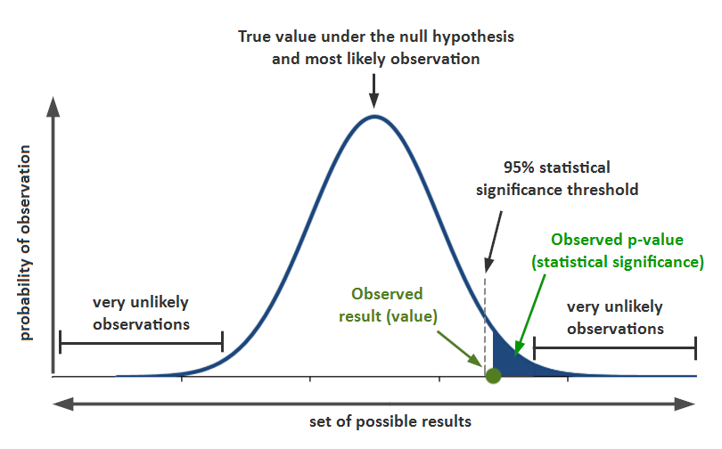

# A/B Testing Project: Redesigning for Increased Conversions
In this A/B testing project, we undertake the task of designing, creating, and evaluating an A/B test using subscription data for a service similar to Medium, which offers annual subscriptions priced at 200 units and paid in a single installment.

The primary objective of this project is to enhance the conversion rates, particularly focusing on encouraging users to create an account, through the redesign of the website. With the front-end UX/UI prepared for the implementation of the new page layout, the project aims to assess the impact of this redesign on conversion metrics.

## Exploratory Data Analysis
Before delving into the A/B test, an exploratory analysis of the data has been conducted. This preliminary examination provides insights into the distribution and characteristics of the subscription data. It helps in understanding the baseline metrics before the redesign implementation.

## Hypothesis Test Design
Hypotheses Formulation
The hypothesis test is structured around two main hypotheses:

### Null Hypothesis ($H_0$)
The null hypothesis states that the redesign of the page has no significant effect on the conversion rate. In statistical terms:

$H_0: \ \ \ \ \ \ p = p_0$

where $p_0$ represents the conversion probability of the original page.

### Alternative Hypothesis ($H_1$)
Conversely, the alternative hypothesis asserts that the redesigned page impacts the probability of conversion. It is formulated as:

$H_1: \ \ \ \ \ \ p \neq p_0$

This implies that the conversion rate may either increase or decrease following the redesign.

### Significance Level
A significance level of $5%$ ($\alpha = 0.05$) is chosen for this hypothesis test. This implies that any observed effect with a probability of occurrence less than $5%$ under the assumption of the null hypothesis will lead to its rejection. In other words, we aim for a $95%$ level of confidence in our conclusions.

### Control Groups
To conduct the A/B test effectively, two distinct groups are established:

#### Control Group
The control group comprises users who will continue to interact with the original page design. They serve as the baseline against which the performance of the redesigned page is evaluated.

#### Treatment Group
The treatment group consists of users exposed to the newly redesigned page layout. Any differences in conversion rates observed between the control and treatment groups can be attributed to the effects of the redesign.

It is imperative that the allocation of users to these groups is entirely random, ensuring the validity and reliability of the test results. The front-end team is tasked with implementing a robust randomization mechanism to guarantee unbiased group assignment.

## Minimal Effect

Since the subscriptions offered are annual, and due to internal policies, the analysis must be performed on an annual basis. 

**Metrics:**
+ CPC = 5
+ Annual Maintenance Cost of users is $Co = 100$.
+ Annual CLTV after converting without costs is $V = 200$.
+ CLTV with costs is = $V - C_0 = (200-100)$ 
+ The actual conversion is .12 i.e. $p_0=.12$.

This implies that the expected **CLTV** per user who clicks on the ad is:  
+ $p_0 \times (V-Co) - CPC = .12 \times (200-100) - 5 = 7$  

Note that we are talking about the **Expected Value of the CLTV** not the **CLTV** as such, since we are not evaluating the effect of the redesign on user spending once they subscribe:
+ **CTVL** = 200 - 100. This remains fixed, as it is a metric defined by the company, and is conditional on the person having already subscribed. This definition **does not include acquisition costs, only maintenance and subscription costs**. 
+ The **expected CLTV** includes the acquisition costs, it is the **CLTV** of all our potential buyers, that's why we include the acquisition costs such as the CPC, and also the probability of subscribing $p \ \$ & $\ p_0$.  
To avoid further confusion let us define the **expected CTVL** as $E$.

Where:  
+ $p_0 \times (V-Co)$  is the expected sale for any user who sees the ad, hence we multiply it by $p_0$. We only sell $V$ and pay $Co$ if the user converts.
+ CPC is the average cost per user that is redirected to the page, so you don't have to multiply it. On average the cost per click is 5, the probability of clicking is already implicit in the metric.

# Results
Table probabilities of conversion:

|       Group       | Conversion rate |  Standard deviation  |    Standard error   |
|:-----------------:|:-----------:|:-----------:|:-----------:|:--------------:|
|  Control    | 0.120	|   0.325   |   0.001   |
|:-----------------:|:-----------:|:-----------:|:-----------:|:--------------:|
|  Treatment  | 0.119   |   0.323   |  0.001    |	 
	

Immediately we notice that the conversions are very similar, i.e. $p$ is very close to $p_0$.  
+ $p_0=.120$
+ $p=.119$

z statistic: 1.19
p-value: 0.232
Confidence interval for p_0 at 95%.: [0.118, 0.122]
Confidence interval for p at 95%: [0.117, 0.120]

# Conclusions

Since our **p-value** was a terrible $.232$ far short of our $.05$ we have no evidence to support rejecting $H_0$. Recall that $H_0$ is $p=p_0$ which means that the redesign probably had no effect.

Furthermore, looking at our confidence intervals at $95$% we can see that our desired effect of at least $15$% is not there.

Moreover, even the effect of the new page seems to be negative at best! It's OK, these results sometimes happen...

